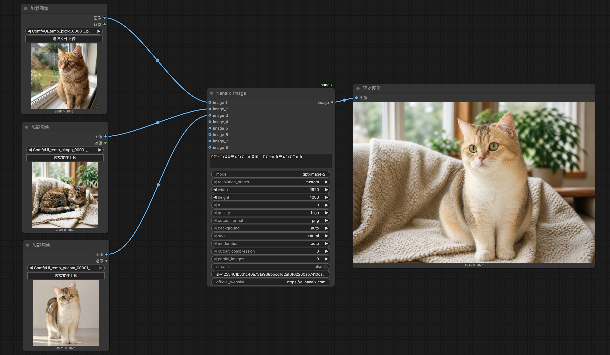
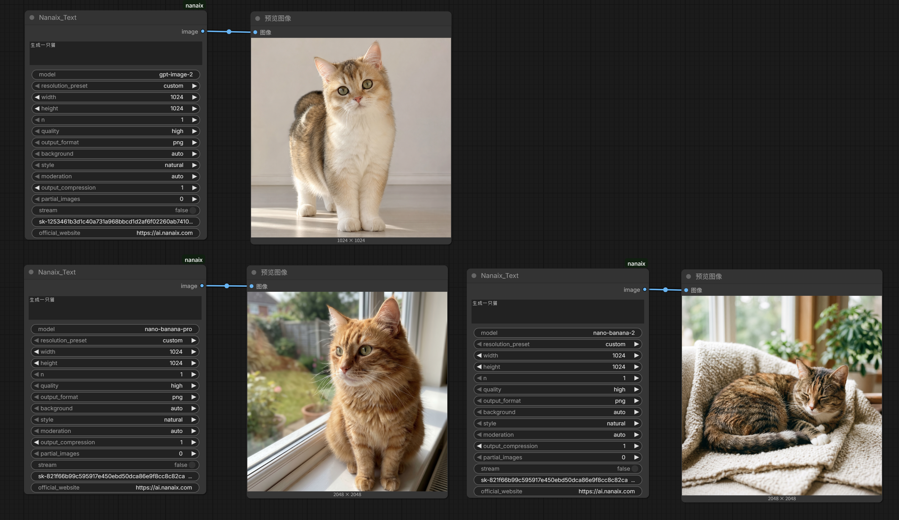

# NanAix ComfyUI Nodes

Use [NanAIX](https://ai.nanaix.com) image generation models directly inside ComfyUI.

This custom node package adds two ComfyUI nodes:

| Node | Purpose | Output |
| --- | --- | --- |
| `Nanaix_Text` | Text-to-image generation | ComfyUI `IMAGE` |
| `Nanaix_Image` | Image-to-image generation or image editing with reference images | ComfyUI `IMAGE` |

The output is native ComfyUI image tensor data, so it can connect directly to built-in nodes such as `PreviewImage`, `SaveImage`, image upscalers, post-processing nodes, and most other image pipelines.

[中文说明在下方](#中文说明)

---

## Highlights

- Native ComfyUI `IMAGE` output, not a URL-only node.
- Two nodes: `Nanaix_Text` and `Nanaix_Image`.
- Supported model families:
  - `gpt-image-*`, including `gpt-image-2`
  - `nano-banana-*`, including `nano-banana-2` and `nano-banana-pro`
- A single visible `api_key` field in each node.
- Free-form `model` input, so future Nanaix model names can be typed without updating the node UI.
- `Nanaix_Image` supports up to 8 reference image inputs.
- Batched reference inputs are expanded into individual reference images before submission.
- Large reference images are downscaled and JPEG-compressed before upload to reduce timeout risk.
- Successful node settings are saved locally and used to prefill newly created nodes.
- Failed runs do not overwrite the last known working local config.
- Detailed errors for missing keys, missing images, invalid API keys, wrong account groups, upstream availability, and timeouts.
- Banana models use the async task flow: submit with `POST /api/generate`, then poll with `GET /api/result?id=task-id`.

---

## Examples

These example images are generated from real ComfyUI runs and are sanitized for GitHub, so they do not include API key screenshots.

### `Nanaix_Image`: Multi-Reference Image Editing



### `Nanaix_Text`: Text-to-Image Across Supported Model Families



---

## Supported Models

The node routes requests by model name prefix:

| Model name | Provider route | Notes |
| --- | --- | --- |
| `gpt-image-2` | image-2 Images API | Text-to-image and image-to-image/editing |
| `gpt-image-*` | image-2 Images API | Free-form future-compatible prefix route |
| `nano-banana-2` | Nano Banana API | Text-to-image and reference-image generation/editing |
| `nano-banana-pro` | Nano Banana API | Text-to-image and reference-image generation/editing |
| `nano-banana-*` | Nano Banana API | Free-form future-compatible prefix route |

Unsupported model names are rejected before any network request is sent.

---

## Quick Install

Clone this repository into your ComfyUI `custom_nodes` folder:

```bash
cd ComfyUI/custom_nodes
git clone https://github.com/nan-boop/NanAix_comfyui.git nanaix_Comfy
```

Install dependencies in the Python environment used by ComfyUI:

```bash
cd nanaix_Comfy
pip install -r requirements.txt
```

Restart ComfyUI after installation.

If you use a portable Windows build, run `pip` through the bundled Python:

```powershell
F:\ComfyUI-aki-v3\python\python.exe -m pip install -r F:\ComfyUI-aki-v3\ComfyUI\custom_nodes\nanaix_Comfy\requirements.txt
```

Then restart ComfyUI and search for:

```text
Nanaix_Text
Nanaix_Image
```

---

## Helper Install Script

If you downloaded the repository somewhere outside ComfyUI, you can deploy it with the helper script:

```bash
python scripts/deploy_to_comfyui.py --custom-nodes "D:\ComfyUI\custom_nodes" --force
```

Use the Python runtime that ComfyUI uses for verification:

```bash
python scripts/deploy_to_comfyui.py --custom-nodes "D:\ComfyUI\custom_nodes" --python "D:\ComfyUI\python\python.exe" --force
```

If you do not know where ComfyUI is installed, scan common locations:

```bash
python scripts/find_comfyui.py
```

Run a local readiness report:

```bash
python scripts/doctor.py
```

Run a one-shot deployment and verification flow:

```bash
python scripts/runbook.py --force
```

---

## Node: `Nanaix_Text`

`Nanaix_Text` generates images from a text prompt.

### Inputs

| Input | Type | Required | Description |
| --- | --- | --- | --- |
| `prompt` | String | Yes | Text prompt describing the image to generate. |
| `model` | String | Yes | Model name, for example `gpt-image-2`, `nano-banana-2`, or `nano-banana-pro`. |
| `api_key` | String | Yes | Nanaix API key for the selected model family. |
| `resolution_preset` | Dropdown | Yes | Common size preset. Use `custom` to keep manual width and height. |
| `width` | Integer | Yes | Requested output width when using `custom`, or a value that may be mapped by the preset. |
| `height` | Integer | Yes | Requested output height when using `custom`, or a value that may be mapped by the preset. |
| `n` | Integer | Yes | Requested number of images. For banana models the node submits one task per image. For image-2, keep `n=1` because the upstream docs recommend not depending on multi-image responses. |
| `quality` | Dropdown | Yes | Output quality selector, commonly `high`, `medium`, or `low`. |
| `output_format` | Dropdown | Yes | Output format preference: `png`, `webp`, or `jpeg`. |
| `background` | Dropdown | Yes | Kept in the UI for image-2-style compatibility. Current stable requests intentionally avoid unstable optional fields unless the provider path supports them reliably. |
| `style` | Dropdown | Yes | Kept in the UI for image-2-style compatibility. |
| `moderation` | Dropdown | Yes | Kept in the UI for image-2-style compatibility. |
| `output_compression` | Integer | Yes | Kept in the UI for image-2-style compatibility. |
| `partial_images` | Integer | Yes | Kept in the UI for image-2-style compatibility. |
| `stream` | Boolean | Yes | Kept in the UI for image-2-style compatibility. |
| `official_website` | String | Yes | Read-only helper field pointing to `https://ai.nanaix.com`. |

### Output

| Output | Type | Description |
| --- | --- | --- |
| `image` | `IMAGE` | Standard ComfyUI image output. Connect it to `PreviewImage`, `SaveImage`, or downstream image nodes. |

---

## Node: `Nanaix_Image`

`Nanaix_Image` generates or edits images using one or more reference images.

### Inputs

| Input | Type | Required | Description |
| --- | --- | --- | --- |
| `prompt` | String | Yes | Describe the final image or edit instruction. |
| `model` | String | Yes | Model name, for example `gpt-image-2`, `nano-banana-2`, or `nano-banana-pro`. |
| `api_key` | String | Yes | Nanaix API key for the selected model family. |
| `image_1` | `IMAGE` | At least one image is required | Main reference image. |
| `image_2` to `image_8` | `IMAGE` | Optional | Additional reference images for style, lighting, layout, subject, or environment cues. |
| `resolution_preset` | Dropdown | Yes | Common size preset. Use `custom` to keep manual width and height. |
| `width` | Integer | Yes | Requested output width. |
| `height` | Integer | Yes | Requested output height. |
| `n` | Integer | Yes | Requested number of images. For banana models the node submits one task per image. For image-2, keep `n=1` for the most predictable behavior. |
| `quality` | Dropdown | Yes | Output quality selector. |
| `output_format` | Dropdown | Yes | Output format preference: `png`, `webp`, or `jpeg`. |
| `background` | Dropdown | Yes | Compatibility field for image-2-style controls. |
| `style` | Dropdown | Yes | Compatibility field for image-2-style controls. |
| `moderation` | Dropdown | Yes | Compatibility field for image-2-style controls. |
| `output_compression` | Integer | Yes | Compatibility field for image-2-style controls. |
| `partial_images` | Integer | Yes | Compatibility field for image-2-style controls. |
| `stream` | Boolean | Yes | Compatibility field for image-2-style controls. |
| `official_website` | String | Yes | Read-only helper field pointing to `https://ai.nanaix.com`. |

### Output

| Output | Type | Description |
| --- | --- | --- |
| `image` | `IMAGE` | Standard ComfyUI image output. It can be previewed, saved, or passed into other image nodes. |

### Reference Image Notes

- Connect at least one reference image before queueing the workflow.
- `image_1` is the best default input for a single-image edit.
- For multi-reference edits, a practical pattern is:
  - `image_1`: subject, composition, silhouette, or main layout.
  - `image_2`: style, lighting, palette, background, or environment.
  - `image_3+`: extra supporting references.
- If a connected reference input is a batch, the node expands it into individual images.
- The current MVP does not expose mask input or local inpainting mask controls.
- Reference images are normalized for upload. Large images are downscaled to a maximum edge of 1536 pixels and encoded as JPEG quality 85 to reduce large-payload timeout risk.

---

## Resolution Presets

| Preset | Size |
| --- | --- |
| `custom` | Use the entered `width` and `height`. |
| `square` | `1024x1024` |
| `square_2k` | `2048x2048` |
| `square_4k` | `4096x4096` |
| `landscape_hd` | `1536x1024` |
| `portrait_hd` | `1024x1536` |
| `landscape_2k` | `2048x1024` |
| `portrait_2k` | `1024x2048` |
| `landscape_4k` | `4096x3072` |
| `portrait_4k` | `3072x4096` |

For image-2 requests, common supported sizes are preserved when possible. For banana requests, width and height are mapped to the provider's `aspectRatio` and `imageSize` concepts internally, but the current stable request path only sends parameters that have been verified to behave reliably.

---

## API Behavior

### image-2 route

Models starting with `gpt-image-` are routed to the image-2 Images API:

- Text generation endpoint: `POST /v1/images/generations`
- Image edit endpoint: `POST /v1/images/edits`
- Model visibility check: `GET /v1/models`

The request is intentionally conservative. The stable text payload includes:

```json
{
  "model": "gpt-image-2",
  "prompt": "A cinematic neon city at night",
  "size": "1024x1024",
  "quality": "high",
  "output_format": "png",
  "response_format": "b64_json"
}
```

For image edits, the node adds serialized reference images to the request.

### Nano Banana route

Models starting with `nano-banana-` are routed to the Nano Banana API:

- Submit task: `POST /v1/api/generate`
- Query task: `GET /v1/api/result?id=task-id`

The stable submit payload includes:

```json
{
  "model": "nano-banana-2",
  "prompt": "A cute orange cat looking at neon signs"
}
```

When reference images are connected, the node adds an `images` list. The node then polls the result endpoint until the task reaches a known success or failure state.

Recognized success statuses include:

- `COMPLETED`
- `SUCCEEDED`
- `SUCCESS`
- `DONE`
- `FINISHED`
- lower-case variants such as `succeeded`

Recognized failure statuses include:

- `FAILED`
- `ERROR`
- `CANCELLED`
- `CANCELED`

---

## Local Config Behavior

After a successful run, the node saves working settings to:

```text
nanaix_config.json
```

This file is stored in the plugin root directory and is ignored by Git.

Saved values include:

- `api_key`
- `model`
- `resolution_preset`
- `width`
- `height`
- `n`
- `quality`
- `output_format`
- `background`
- `style`
- `moderation`
- `output_compression`
- `partial_images`
- `stream`

Important details:

- The config is saved only after a successful run.
- Failed runs do not overwrite the last working config.
- Newly created nodes try to prefill from the saved config.
- Saved config is not a hidden runtime fallback.
- If the visible `api_key` field is blank, the node raises an error even if `nanaix_config.json` contains an old key.
- Legacy config files with `image2_api_key` or `banana_api_key` are migrated into the current single `api_key` field when possible.

---

## Example Workflows

Example ComfyUI workflows are included:

| File | Purpose |
| --- | --- |
| `examples/minimal_text_workflow.json` | Minimal `Nanaix_Text -> PreviewImage/SaveImage` workflow. |
| `examples/minimal_image_workflow.json` | Minimal `LoadImage -> Nanaix_Image -> PreviewImage/SaveImage` workflow. |
| `examples/minimal_multi_image_workflow.json` | Multi-reference `Nanaix_Image` workflow using multiple `LoadImage` nodes. |

Import one of these JSON files into ComfyUI to start quickly.

---

## Smoke Tests Outside ComfyUI

Run a text generation smoke test with image-2:

```bash
python scripts/smoke_test.py --model gpt-image-2 --prompt "A red lantern on a rainy street" --image2-key YOUR_IMAGE2_KEY --output output.png
```

Run a text generation smoke test with banana:

```bash
python scripts/smoke_test.py --model nano-banana-pro --prompt "A red lantern on a rainy street" --banana-key YOUR_BANANA_KEY --output output.png
```

Run an image edit smoke test:

```bash
python scripts/smoke_test.py --model nano-banana-2 --prompt "Turn this into a watercolor illustration" --banana-key YOUR_BANANA_KEY --reference-image input.png --output edited.png
```

List visible image-2 models:

```bash
python scripts/smoke_test.py --model gpt-image-2 --image2-key YOUR_IMAGE2_KEY --list-models
```

List supported banana models:

```bash
python scripts/smoke_test.py --model nano-banana-pro --banana-key YOUR_BANANA_KEY --list-models
```

Run a preflight check without generating an image:

```bash
python scripts/smoke_test.py --model gpt-image-2 --image2-key YOUR_IMAGE2_KEY --preflight
python scripts/smoke_test.py --model nano-banana-pro --banana-key YOUR_BANANA_KEY --preflight
```

To avoid putting keys directly into shell history, set environment variables:

```bash
set NANAIX_IMAGE2_API_KEY=YOUR_IMAGE2_KEY
set NANAIX_BANANA_API_KEY=YOUR_BANANA_KEY
```

On PowerShell:

```powershell
$env:NANAIX_IMAGE2_API_KEY="YOUR_IMAGE2_KEY"
$env:NANAIX_BANANA_API_KEY="YOUR_BANANA_KEY"
```

The ComfyUI nodes themselves use the visible `api_key` widget. The environment variables are for helper scripts and live smoke tests.

---

## ComfyUI Verification Scripts

Verify the package import from a custom nodes directory:

```bash
python scripts/verify_install.py --custom-nodes "D:\ComfyUI\custom_nodes"
```

Start a temporary ComfyUI instance and confirm the nodes register:

```bash
python scripts/comfyui_smoke.py --comfy-root "D:\ComfyUI\ComfyUI" --python "D:\ComfyUI\python\python.exe"
```

Submit one of the bundled workflows to a running ComfyUI instance:

```bash
python scripts/workflow_smoke.py --workflow examples/minimal_text_workflow.json --comfy-root "D:\ComfyUI\ComfyUI" --python "D:\ComfyUI\python\python.exe"
```

Run a live end-to-end generation smoke test through ComfyUI:

```bash
python scripts/live_comfy_smoke.py --comfy-root "D:\ComfyUI\ComfyUI" --python "D:\ComfyUI\python\python.exe"
```

Run a live image-edit smoke test:

```bash
python scripts/live_comfy_smoke.py --mode image --comfy-root "D:\ComfyUI\ComfyUI" --python "D:\ComfyUI\python\python.exe" --input-image-name "workflow_smoke_input.png"
```

---

## Troubleshooting

### `Invalid API key`

The key is wrong, missing, or not being sent. Paste the correct key into the node's visible `api_key` field.

### `Images API is not supported for this platform`

The key likely belongs to a group that does not have image API access. Use a key from an image-enabled Nanaix group.

### `No available compatible accounts`

The upstream service currently has no compatible available account. Retry later or use another model/key if available.

### `At least one reference image is required`

`Nanaix_Image` needs at least one connected `IMAGE` input. Connect a `LoadImage` node to `image_1`.

### `request timed out while waiting for Nanaix`

The request or result download took too long. For image editing, try fewer reference images, smaller reference images, or a smaller output size.

### Banana task timed out waiting for completion

Banana models are asynchronous. The node submits a task and polls `/api/result?id=task-id`. If the task does not finish before the local timeout, the node reports the task id so you can retry or query it manually.

### Node changes do not appear in ComfyUI

Restart ComfyUI. Python custom nodes are imported at startup and are not always hot-reloaded correctly.

---

## Development

Install development dependencies:

```bash
pip install -r requirements.txt
```

Run tests:

```bash
pytest -q
```

Build a release zip:

```bash
python scripts/package_release.py --output-dir "D:\releases"
```

Build and verify with a ComfyUI Python runtime:

```bash
python scripts/package_release.py --output-dir "D:\releases" --python "D:\ComfyUI\python\python.exe"
```

The package includes ComfyUI node help pages:

- `web/docs/Nanaix_Text.md`
- `web/docs/Nanaix_Image.md`

---

## Repository Layout

```text
nanaix_Comfy/
  __init__.py
  nodes/
    nanaix_text.py
    nanaix_image.py
  services/
    image2_client.py
    banana_client.py
    router.py
  utils/
    image_io.py
    size_mapping.py
    validation.py
    errors.py
  config/
    settings.py
  web/docs/
    Nanaix_Text.md
    Nanaix_Image.md
  examples/
    minimal_text_workflow.json
    minimal_image_workflow.json
    minimal_multi_image_workflow.json
  scripts/
    doctor.py
    deploy_to_comfyui.py
    smoke_test.py
    runbook.py
```

---

## Security Notes

- Do not commit `nanaix_config.json`.
- Do not share API keys in screenshots, workflow JSON, issues, or logs.
- The node requires the visible `api_key` field to be filled before generation.
- Helper scripts can read keys from environment variables, but the ComfyUI nodes use the node widget value.

---

## 中文说明

# NanAix ComfyUI 节点

这个仓库把 [NanAIX](https://ai.nanaix.com) 的图片生成接口接入到 ComfyUI 里，提供两个自定义节点：

| 节点 | 用途 | 输出 |
| --- | --- | --- |
| `Nanaix_Text` | 文生图 | ComfyUI 原生 `IMAGE` |
| `Nanaix_Image` | 图生图 / 参考图生成 / 图片编辑 | ComfyUI 原生 `IMAGE` |

节点最终返回的是 ComfyUI 标准图片数据，不是单纯的 URL，所以可以直接连接原生的 `PreviewImage`、`SaveImage`、放大节点、后处理节点，以及其他图片工作流节点。

---

## 功能特点

- 输出为 ComfyUI 原生 `IMAGE`，可直接预览和保存。
- 提供 `Nanaix_Text` 和 `Nanaix_Image` 两个节点。
- 支持模型族：
  - `gpt-image-*`，例如 `gpt-image-2`
  - `nano-banana-*`，例如 `nano-banana-2`、`nano-banana-pro`
- 节点里只有一个可见密钥输入框：`api_key`。
- `model` 是自由文本输入，后续有新模型时用户可以自己填写模型名，不需要频繁改节点代码。
- `Nanaix_Image` 支持最多 8 路参考图输入。
- 如果输入的是图片 batch，节点会自动拆成多张参考图再提交。
- 大尺寸参考图会在上传前压缩到最长边 1536，并转成 JPEG quality 85，降低请求体过大导致超时的概率。
- 成功运行后会保存本地配置，新建节点时自动预填。
- 失败运行不会覆盖上一次成功的配置。
- 缺密钥、缺参考图、密钥错误、账号组不支持图片、上游账号不可用、请求超时等情况都会返回更具体的错误信息。
- Banana 模型使用异步任务流程：先 `POST /api/generate` 提交，再 `GET /api/result?id=task-id` 查询结果。

---

## 示例图

下面两张图来自真实 ComfyUI 运行结果，并且已经做成适合 GitHub 展示的安全版本，不包含 API key 截图。

### `Nanaix_Image`：多参考图图生图示例


### `Nanaix_Text`：文生图多模型示例


---

## 支持的模型

节点按模型名前缀自动路由：

| 模型名 | 路由到 | 说明 |
| --- | --- | --- |
| `gpt-image-2` | image-2 Images API | 文生图和图生图 |
| `gpt-image-*` | image-2 Images API | 兼容未来同前缀模型 |
| `nano-banana-2` | Nano Banana API | 文生图和参考图生成 |
| `nano-banana-pro` | Nano Banana API | 文生图和参考图生成 |
| `nano-banana-*` | Nano Banana API | 兼容未来同前缀模型 |

如果模型名不以 `gpt-image-` 或 `nano-banana-` 开头，节点会在发送网络请求前直接报错。

---

## 快速安装

进入 ComfyUI 的 `custom_nodes` 目录，然后克隆仓库：

```bash
cd ComfyUI/custom_nodes
git clone https://github.com/nan-boop/NanAix_comfyui.git nanaix_Comfy
```

安装依赖：

```bash
cd nanaix_Comfy
pip install -r requirements.txt
```

如果你用的是 Windows 便携版 ComfyUI，建议用 ComfyUI 自带的 Python 安装：

```powershell
F:\ComfyUI-aki-v3\python\python.exe -m pip install -r F:\ComfyUI-aki-v3\ComfyUI\custom_nodes\nanaix_Comfy\requirements.txt
```

然后重启 ComfyUI，在节点搜索里查找：

```text
Nanaix_Text
Nanaix_Image
```

---

## 使用部署脚本安装

如果仓库不在 ComfyUI 目录里，也可以用脚本复制部署：

```bash
python scripts/deploy_to_comfyui.py --custom-nodes "D:\ComfyUI\custom_nodes" --force
```

指定 ComfyUI 使用的 Python 做验证：

```bash
python scripts/deploy_to_comfyui.py --custom-nodes "D:\ComfyUI\custom_nodes" --python "D:\ComfyUI\python\python.exe" --force
```

不知道 ComfyUI 在哪里时，可以扫描：

```bash
python scripts/find_comfyui.py
```

查看本地诊断报告：

```bash
python scripts/doctor.py
```

一键部署并验证：

```bash
python scripts/runbook.py --force
```

---

## 节点：`Nanaix_Text`

`Nanaix_Text` 用提示词直接生成图片。

### 输入参数

| 参数 | 类型 | 必填 | 说明 |
| --- | --- | --- | --- |
| `prompt` | 字符串 | 是 | 图片提示词。 |
| `model` | 字符串 | 是 | 模型名，例如 `gpt-image-2`、`nano-banana-2`、`nano-banana-pro`。 |
| `api_key` | 字符串 | 是 | 当前模型对应的 NanAIX 密钥。 |
| `resolution_preset` | 下拉选项 | 是 | 常用分辨率预设。选 `custom` 时使用手动宽高。 |
| `width` | 整数 | 是 | 输出宽度。 |
| `height` | 整数 | 是 | 输出高度。 |
| `n` | 整数 | 是 | 生成数量。Banana 模型会按数量提交多个任务；image-2 建议保持 `1`，因为上游文档建议不要依赖多图返回。 |
| `quality` | 下拉选项 | 是 | 质量选项，常用 `high`、`medium`、`low`。 |
| `output_format` | 下拉选项 | 是 | 输出格式：`png`、`webp`、`jpeg`。 |
| `background` | 下拉选项 | 是 | 保留的 image-2 风格兼容参数。当前稳定请求会避免发送容易导致上游 502 的不稳定可选字段。 |
| `style` | 下拉选项 | 是 | 保留的 image-2 风格兼容参数。 |
| `moderation` | 下拉选项 | 是 | 保留的 image-2 风格兼容参数。 |
| `output_compression` | 整数 | 是 | 保留的 image-2 风格兼容参数。 |
| `partial_images` | 整数 | 是 | 保留的 image-2 风格兼容参数。 |
| `stream` | 布尔值 | 是 | 保留的 image-2 风格兼容参数。 |
| `official_website` | 字符串 | 是 | 只读官网提示：`https://ai.nanaix.com`。 |

### 输出

| 输出 | 类型 | 说明 |
| --- | --- | --- |
| `image` | `IMAGE` | ComfyUI 标准图片输出，可以直接接 `PreviewImage`、`SaveImage` 或其他图片节点。 |

---

## 节点：`Nanaix_Image`

`Nanaix_Image` 用一张或多张参考图生成/编辑图片。

### 输入参数

| 参数 | 类型 | 必填 | 说明 |
| --- | --- | --- | --- |
| `prompt` | 字符串 | 是 | 描述最终想要的图片或编辑方向。 |
| `model` | 字符串 | 是 | 模型名，例如 `gpt-image-2`、`nano-banana-2`、`nano-banana-pro`。 |
| `api_key` | 字符串 | 是 | 当前模型对应的 NanAIX 密钥。 |
| `image_1` | `IMAGE` | 至少需要一路图片 | 主参考图。 |
| `image_2` 到 `image_8` | `IMAGE` | 否 | 额外参考图，可用于风格、光影、主体、布局、环境等。 |
| `resolution_preset` | 下拉选项 | 是 | 常用分辨率预设。选 `custom` 时使用手动宽高。 |
| `width` | 整数 | 是 | 输出宽度。 |
| `height` | 整数 | 是 | 输出高度。 |
| `n` | 整数 | 是 | 生成数量。Banana 模型会按数量提交多个任务；image-2 建议保持 `1`。 |
| `quality` | 下拉选项 | 是 | 质量选项。 |
| `output_format` | 下拉选项 | 是 | 输出格式：`png`、`webp`、`jpeg`。 |
| `background` | 下拉选项 | 是 | 保留的 image-2 风格兼容参数。 |
| `style` | 下拉选项 | 是 | 保留的 image-2 风格兼容参数。 |
| `moderation` | 下拉选项 | 是 | 保留的 image-2 风格兼容参数。 |
| `output_compression` | 整数 | 是 | 保留的 image-2 风格兼容参数。 |
| `partial_images` | 整数 | 是 | 保留的 image-2 风格兼容参数。 |
| `stream` | 布尔值 | 是 | 保留的 image-2 风格兼容参数。 |
| `official_website` | 字符串 | 是 | 只读官网提示：`https://ai.nanaix.com`。 |

### 输出

| 输出 | 类型 | 说明 |
| --- | --- | --- |
| `image` | `IMAGE` | ComfyUI 标准图片输出，可以直接预览、保存或继续接其他节点。 |

### 参考图建议

- 队列运行前必须至少连接一张参考图。
- 单图编辑优先使用 `image_1`。
- 多参考图常用方式：
  - `image_1`：主体、构图、轮廓、主要布局。
  - `image_2`：风格、光影、色彩、背景、环境。
  - `image_3+`：更多辅助参考。
- 如果某一路输入本身是 batch，节点会拆成多张参考图。
- 当前 MVP 不提供蒙版输入，也不提供局部重绘 mask 控件。
- 参考图上传前会做归一化处理。大图会压到最长边 1536，并用 JPEG quality 85 编码，降低请求体过大导致超时的概率。

---

## 分辨率预设

| 预设 | 尺寸 |
| --- | --- |
| `custom` | 使用手动输入的 `width` 和 `height` |
| `square` | `1024x1024` |
| `square_2k` | `2048x2048` |
| `square_4k` | `4096x4096` |
| `landscape_hd` | `1536x1024` |
| `portrait_hd` | `1024x1536` |
| `landscape_2k` | `2048x1024` |
| `portrait_2k` | `1024x2048` |
| `landscape_4k` | `4096x3072` |
| `portrait_4k` | `3072x4096` |

image-2 路径会尽量保留常见支持尺寸。Banana 路径内部会把宽高映射到上游的比例和尺寸概念，但当前稳定请求只发送已经验证更可靠的字段。

---

## 接口行为说明

### image-2 路径

模型名以 `gpt-image-` 开头时走 image-2 Images API：

- 文生图：`POST /v1/images/generations`
- 图生图：`POST /v1/images/edits`
- 模型列表：`GET /v1/models`

当前请求会尽量保守，文生图稳定 payload 类似：

```json
{
  "model": "gpt-image-2",
  "prompt": "A cinematic neon city at night",
  "size": "1024x1024",
  "quality": "high",
  "output_format": "png",
  "response_format": "b64_json"
}
```

图生图会在此基础上加入序列化后的参考图。

### Nano Banana 路径

模型名以 `nano-banana-` 开头时走 Nano Banana API：

- 提交任务：`POST /v1/api/generate`
- 查询任务：`GET /v1/api/result?id=task-id`

稳定提交 payload 类似：

```json
{
  "model": "nano-banana-2",
  "prompt": "A cute orange cat looking at neon signs"
}
```

如果连接了参考图，节点会加入 `images` 列表。提交后节点会轮询结果接口，直到任务成功、失败或超时。

已识别成功状态：

- `COMPLETED`
- `SUCCEEDED`
- `SUCCESS`
- `DONE`
- `FINISHED`
- 小写状态，例如 `succeeded`

已识别失败状态：

- `FAILED`
- `ERROR`
- `CANCELLED`
- `CANCELED`

---

## 本地配置行为

成功运行后，节点会把可复用配置保存到插件根目录：

```text
nanaix_config.json
```

这个文件已加入 `.gitignore`，不要提交到 GitHub。

保存字段包括：

- `api_key`
- `model`
- `resolution_preset`
- `width`
- `height`
- `n`
- `quality`
- `output_format`
- `background`
- `style`
- `moderation`
- `output_compression`
- `partial_images`
- `stream`

注意：

- 只有成功运行后才保存。
- 失败运行不会覆盖上一次成功配置。
- 新建节点会尝试读取本地配置并预填。
- 本地配置不是隐藏兜底。
- 如果节点界面里的 `api_key` 是空的，即使配置文件里有旧密钥，也会报错。
- 旧版本配置里的 `image2_api_key` 或 `banana_api_key` 会尽量迁移到现在的单个 `api_key` 字段。

---

## 示例工作流

仓库里包含示例 ComfyUI workflow：

| 文件 | 用途 |
| --- | --- |
| `examples/minimal_text_workflow.json` | 最小 `Nanaix_Text -> PreviewImage/SaveImage` 工作流。 |
| `examples/minimal_image_workflow.json` | 最小 `LoadImage -> Nanaix_Image -> PreviewImage/SaveImage` 工作流。 |
| `examples/minimal_multi_image_workflow.json` | 多参考图 `Nanaix_Image` 工作流。 |

可以直接导入 ComfyUI 使用。

---

## ComfyUI 外部 smoke test

image-2 文生图：

```bash
python scripts/smoke_test.py --model gpt-image-2 --prompt "A red lantern on a rainy street" --image2-key YOUR_IMAGE2_KEY --output output.png
```

banana 文生图：

```bash
python scripts/smoke_test.py --model nano-banana-pro --prompt "A red lantern on a rainy street" --banana-key YOUR_BANANA_KEY --output output.png
```

图生图：

```bash
python scripts/smoke_test.py --model nano-banana-2 --prompt "Turn this into a watercolor illustration" --banana-key YOUR_BANANA_KEY --reference-image input.png --output edited.png
```

查看 image-2 可见模型：

```bash
python scripts/smoke_test.py --model gpt-image-2 --image2-key YOUR_IMAGE2_KEY --list-models
```

查看 banana 支持模型：

```bash
python scripts/smoke_test.py --model nano-banana-pro --banana-key YOUR_BANANA_KEY --list-models
```

只做密钥/模型可见性预检，不实际生成：

```bash
python scripts/smoke_test.py --model gpt-image-2 --image2-key YOUR_IMAGE2_KEY --preflight
python scripts/smoke_test.py --model nano-banana-pro --banana-key YOUR_BANANA_KEY --preflight
```

为了避免密钥进入命令历史，可以设置环境变量：

```bash
set NANAIX_IMAGE2_API_KEY=YOUR_IMAGE2_KEY
set NANAIX_BANANA_API_KEY=YOUR_BANANA_KEY
```

PowerShell：

```powershell
$env:NANAIX_IMAGE2_API_KEY="YOUR_IMAGE2_KEY"
$env:NANAIX_BANANA_API_KEY="YOUR_BANANA_KEY"
```

注意：ComfyUI 节点本身使用节点界面里的 `api_key` 字段；环境变量主要给脚本和 live smoke test 使用。

---

## 常见问题

### `Invalid API key`

密钥错误、缺失或未发送。请把正确密钥填到节点可见的 `api_key` 字段。

### `Images API is not supported for this platform`

当前密钥所在分组可能没有图片接口权限。请使用图片组的 NanAIX 密钥。

### `No available compatible accounts`

上游暂时没有可用兼容账号。可以稍后重试，或切换其他可用模型/密钥。

### `At least one reference image is required`

`Nanaix_Image` 至少要连接一张图片。常见做法是用 `LoadImage` 接到 `image_1`。

### `request timed out while waiting for Nanaix`

请求或结果下载耗时过长。图生图时建议减少参考图数量、缩小参考图尺寸，或降低输出尺寸。

### Banana task timed out waiting for completion

Banana 模型是异步任务。节点会先提交任务，再查询 `/api/result?id=task-id`。如果任务在本地等待时间内没有完成，会报出 task id，方便重试或手动查询。

### 节点更新后 ComfyUI 里没变化

重启 ComfyUI。Python 自定义节点通常在启动时导入，不一定能可靠热更新。

---

## 开发

安装依赖：

```bash
pip install -r requirements.txt
```

运行测试：

```bash
pytest -q
```

打包发布 zip：

```bash
python scripts/package_release.py --output-dir "D:\releases"
```

使用 ComfyUI 的 Python 进行打包验证：

```bash
python scripts/package_release.py --output-dir "D:\releases" --python "D:\ComfyUI\python\python.exe"
```

节点内置帮助文档：

- `web/docs/Nanaix_Text.md`
- `web/docs/Nanaix_Image.md`

---

## 安全建议

- 不要提交 `nanaix_config.json`。
- 不要在截图、workflow JSON、issue、日志里泄露 API key。
- 节点运行前必须填写可见的 `api_key`。
- 脚本可以从环境变量读取 key，但 ComfyUI 节点使用节点里的输入框。
